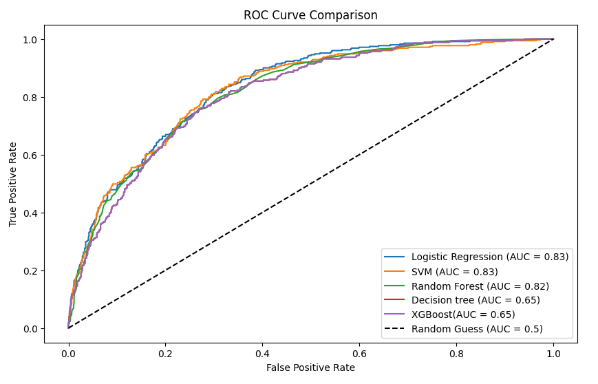
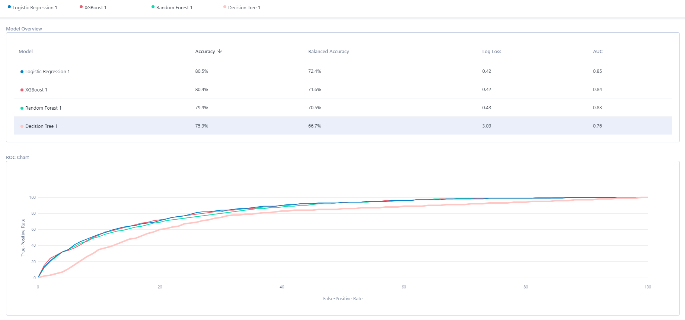
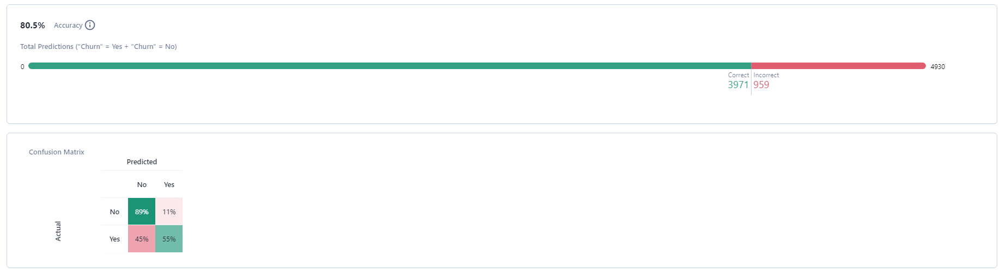
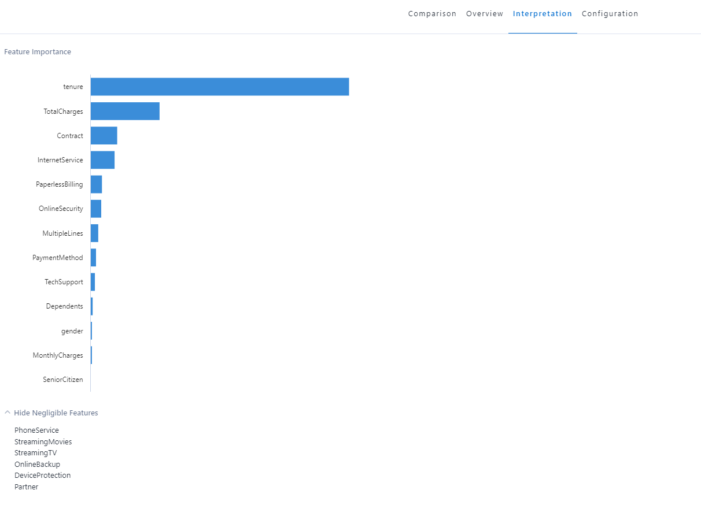
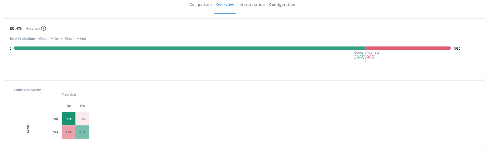
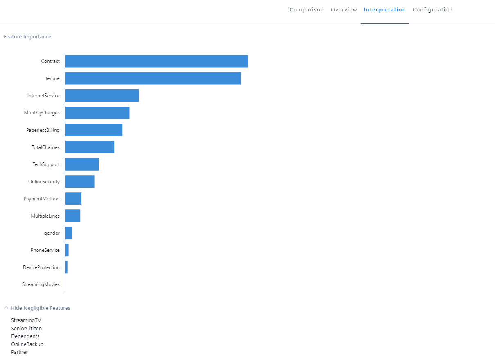
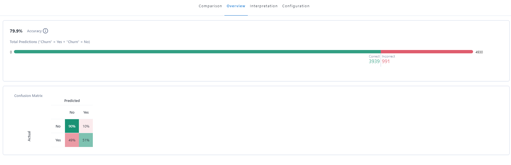
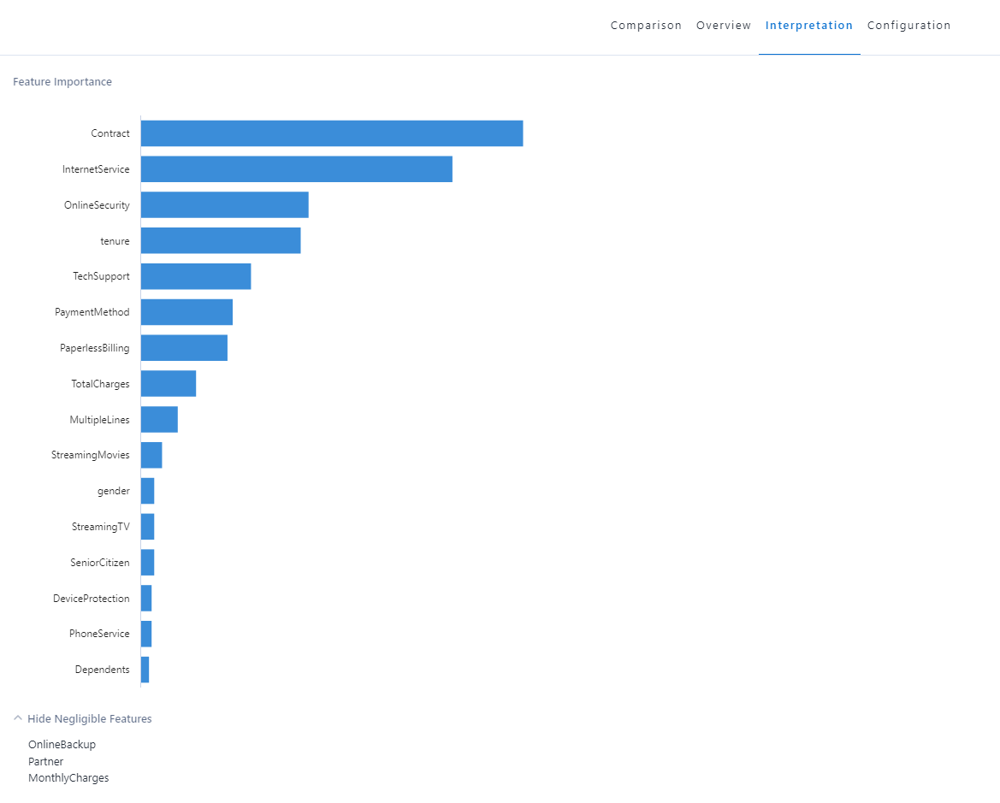
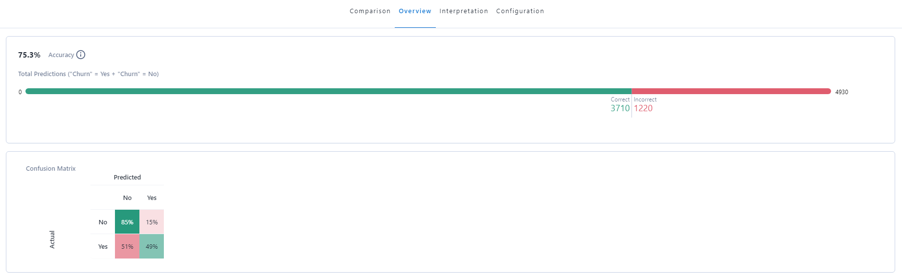
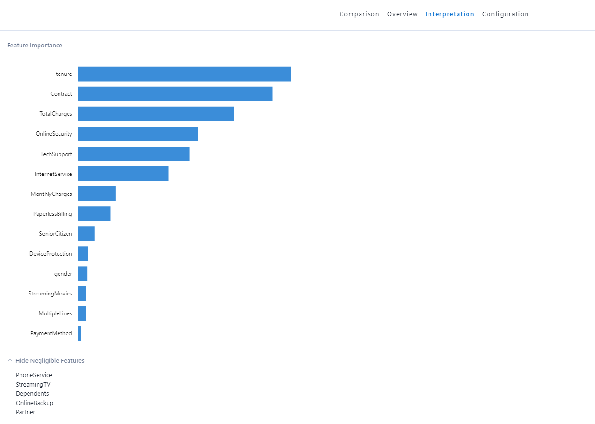

# Comparison of Python Output and Alteryx Output

## Alteryx
### Logistic Regression
- 80.5% Accuracy 
- **3971 out of 4930 Correct**.  

### XGBoost
- 80.4% Accuracy 
- **3965 out of 4930 Correct**.  

### Random Forest
- 79.9% Accuracy 
- **3939 out of 4930 Correct**.  

### Decision Tree
- 75.3% Accuracy 
- **3710 out of 4930 Correct**.  

