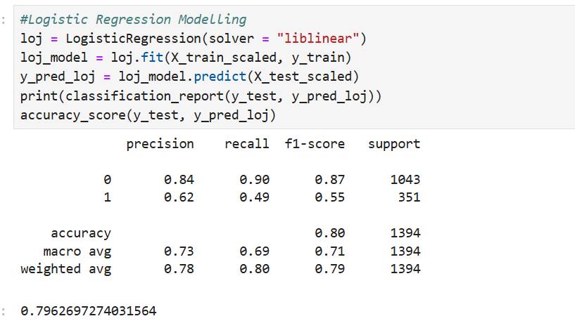
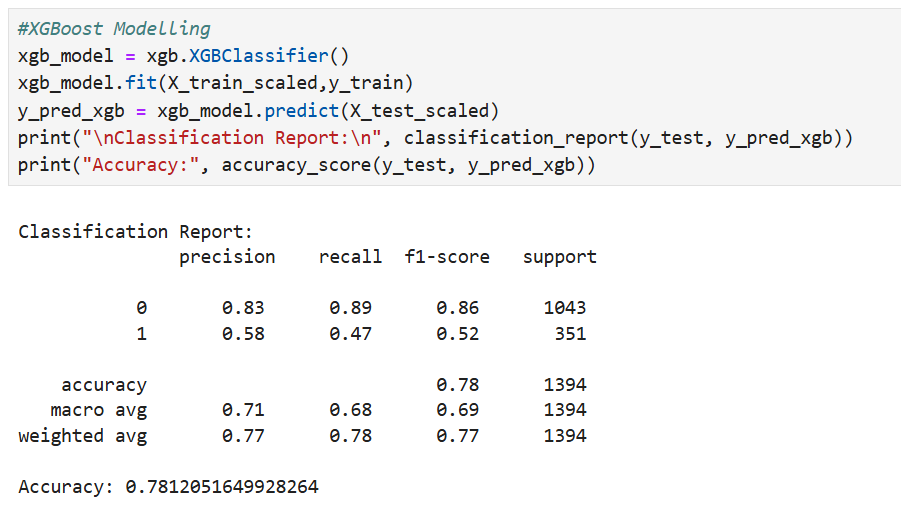
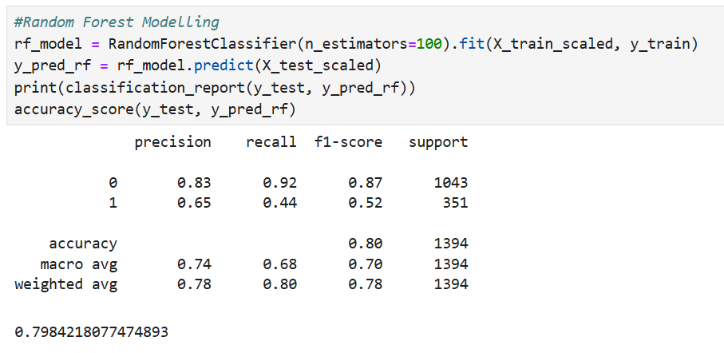
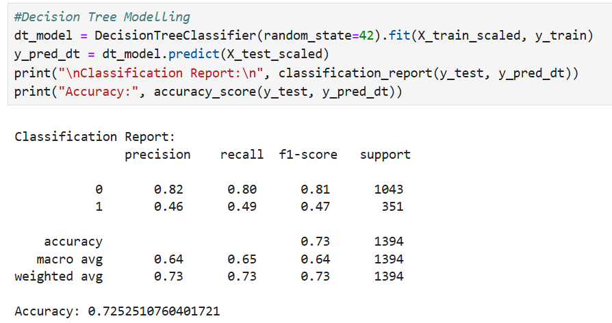

# Background and Summary
Customer churn is defined as when customers or subscribers discontinue doing business with a firm or service.
Customers in the telecom industry can choose from a variety of service providers and actively switch from one to the next. The telecommunications business has an annual churn rate of 15-25 percent in this highly competitive market.
Individualized customer retention is tough because most firms have a large number of customers and can't afford to devote much time to each of them. The costs would be too great, outweighing the additional revenue. However, if a corporation could forecast which customers are likely to leave ahead of time, it could focus customer retention efforts only on these "high risk" clients. The ultimate goal is to expand its coverage area and retrieve more customers loyalty. The core to succeed in this market lies in the customer itself.
Customer churn is a critical metric because it is much less expensive to retain existing customers than it is to acquire new customers.
To reduce customer churn, telecom companies need to predict which customers are at high risk of churn.
To detect early signs of potential churn, one must first develop a holistic view of the customers and their interactions across numerous channels, including store/branch visits, product purchase histories, customer service calls, Web-based transactions, and social media interactions, to mention a few.
As a result, by addressing churn, these businesses may not only preserve their market position, but also grow and thrive. More customers they have in their network, the lower the cost of initiation and the larger the profit. As a result, the company's key focus for success is reducing client attrition and implementing effective retention strategy.

In this example customer churn prediction analysis was carried out using Python and Assisted Modeling of Alteryx Intelligence Suite to get an idea how close the outcomes are:

# Comparison of Python Output and Alteryx Output for Customer Churn Prediction

## Logistic Regression
### Alteryx
- 80.5% Accuracy 
- **3971 out of 4930 Correct**.  

### Python

## XGBoost
### Alteryx
- 80.4% Accuracy 
- **3965 out of 4930 Correct**.  

### Python

## Random Forest
### Alteryx
- 79.9% Accuracy 
- **3939 out of 4930 Correct**.  

### Python

## Decision Tree
### Alteryx
- 75.3% Accuracy 
- **3710 out of 4930 Correct**.  

### Python

